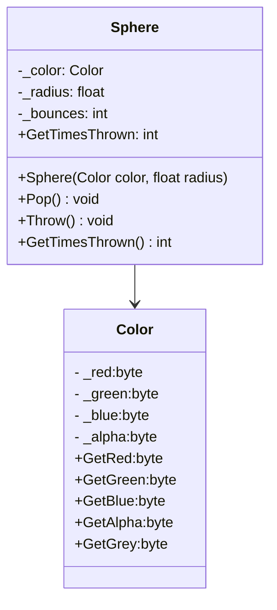

```mermaid

classDiagram
    class Sphere {
    -_color: Color 
    -_radius: float 
    -_bounces: int
    +GetTimesThrown: int
    +Sphere(Color color, float radius)
    +Pop() void
    +Throw() void
    +GetTimesThrown() int

    }

    class Color {

        - _red:byte
        - _green:byte
        - _blue:byte
        - _alpha:byte

        +GetRed:byte
        +GetGreen:byte
        +GetBlue:byte
        +GetAlpha:byte
        +GetGrey:byte
    }

    Sphere --> Color

```